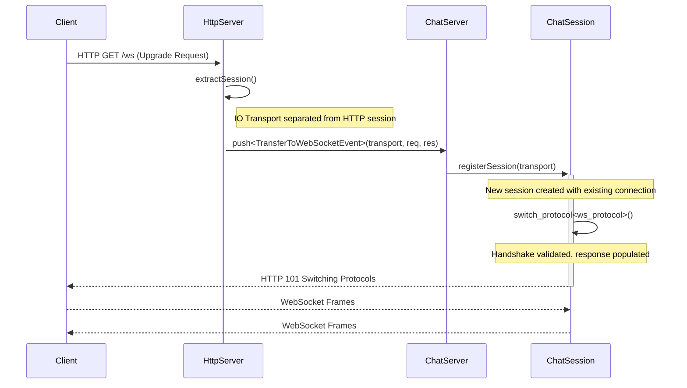

# QB WebSocket Chat Examples

These examples demonstrate advanced WebSocket usage with the QB Actor Framework, showcasing separated architectures, transport extraction, and real-time communication patterns.

- **`01_chat_server.cpp`** - Chat server with HTTP/WebSocket separation
- **`02_chat_client.cpp`** - Command-line WebSocket chat client

## 🎯 Key Concepts Demonstrated

- **Responsibility Separation**: Using distinct Actors for HTTP and WebSocket concerns.
- **Transport Extraction**: Seamlessly handing off a live TCP connection from one handler to another.
- **Protocol Switching**: Dynamically upgrading a connection from HTTP to the WebSocket protocol.
- **Dual Actor Architecture**: Building complex applications by composing specialized actors.
- **Event-Driven Communication**: Using asynchronous events for inter-actor messaging.

---

## 🏗️ Server Architecture (`01_chat_server.cpp`)

This example uses a powerful pattern where the HTTP Server and WebSocket Server are two distinct actors, providing a clean separation of concerns.

### Architectural Flow

The following diagram illustrates how a client's request to upgrade to WebSocket is handled by transferring the connection from the `HttpServer` to the `ChatServer`.



### 1. `HttpServer`: The Public Gateway

The `HttpServer` acts as the entry point. It serves static files (the web UI) and API endpoints. When it receives a request on `/ws`, its only job is to forward the connection to the `ChatServer`.

```cpp
class HttpServer : public qb::Actor,
                   public qb::http::use<HttpServer>::template server<HttpSession> {
private:
    qb::ActorId _chat_server_id;

public:
    bool onInit() override {
        // ... setup for static files and other routes ...

        // This route handles the WebSocket upgrade request.
        router().get("/ws", [this](auto ctx) {
            // 🔑 TRANSPORT EXTRACTION!
            // This pulls the underlying socket connection out of the HTTP session.
            auto [transport, success] = extractSession(ctx->session()->id());

            if (success) {
                // Transfer the live connection to the ChatServer via an actor event.
                auto &event = push<TransferToWebSocketEvent>(_chat_server_id);
                event.data->transport = std::move(transport);
                event.data->request = std::move(ctx->request());
                event.data->response = std::move(ctx->response());
            }
        });

        router().compile();
        listen({"tcp://0.0.0.0:" + std::to_string(_port)});
        start();
        return true;
    }
};
```

### 2. `ChatServer`: The WebSocket Specialist

The `ChatServer` is a pure `io_handler` that knows nothing about HTTP routing. Its sole purpose is to manage WebSocket clients.

```cpp
class ChatServer : public qb::Actor,
                   public qb::io::use<ChatServer>::tcp::io_handler<ChatSession> {
public:
    bool onInit() override {
        registerEvent<TransferToWebSocketEvent>(*this);
        return true;
    }

    void on(TransferToWebSocketEvent& event) {
        // 🎯 RECEIVING TRANSFERRED TRANSPORT
        auto& chat_session = registerSession(std::move(event.data->transport));

        // 🔄 PROTOCOL SWITCHING
        // switch_protocol attempts the handshake. It returns true on success
        // and populates the response object with the "101 Switching Protocols" reply.
        if (chat_session.switch_protocol<ChatSession::ws_protocol>(chat_session, event.data->request, event.data->response)) {
            // Handshake successful, send the response to the client to finalize.
            chat_session << event.data->response;
            ++_connected_users;
        } else {
            // Handshake failed (e.g., not a valid WebSocket request).
            chat_session.disconnect();
        }
    }
};
```

### 3. `ChatSession`: The Individual Connection Handler

Each connected WebSocket client is managed by a `ChatSession` instance.

```cpp
class ChatSession : public qb::io::use<ChatSession>::tcp::client<ChatServer> {
public:
    using ws_protocol = qb::http::ws::protocol<ChatSession>;

    ChatSession(ChatServer &server) : client(server) {
        init_message_handlers(); // Setup dispatch map
    }

    void on(ws_protocol::message &&event) {
        // ... process incoming WebSocket messages ...
    }
};
```

---

## 💻 Client Architecture (`02_chat_client.cpp`)

The client uses a similar dual-actor architecture to separate network logic from UI logic.

-   **`WebSocketClientActor`**: Handles the WebSocket connection, handshake, and message serialization/deserialization.
-   **`CommandLineActor`**: Manages user input from `stdin` and displays messages received from the `WebSocketClientActor`.

This separation ensures that blocking `stdin` reads do not interfere with the non-blocking network I/O.

---

## 🎨 Patterns and Best Practices

### 1. Clean Message Dispatch

Using a map of function pointers is a clean and scalable way to handle different message types received from the client.

```cpp
class ChatSession {
    qb::unordered_map<std::string, std::function<void(const qb::json&)>> _handlers;

    void init_message_handlers() {
        _handlers["message"] = [this](const qb::json& msg) { /* ... */ };
        _handlers["username_update"] = [this](const qb::json& msg) { /* ... */ };
    }

    void on(ws_protocol::message &&event) {
        auto data = qb::json::parse(event.ws.data().view());
        auto type = data.value("type", "");

        if (auto it = _handlers.find(type); it != _handlers.end()) {
            it->second(data);
        } else {
            send_error("Unknown message type: " + type);
        }
    }
};
```

### 2. Efficient Broadcasting

The `io_handler` base class provides the `stream_if()` method, which is a highly efficient way to broadcast messages to multiple clients without extra copies.

```cpp
class ChatServer : public qb::io::use<ChatServer>::tcp::io_handler<ChatSession> {
    void broadcast_to_all(const std::string& message) {
        qb::http::ws::MessageText ws_msg;
        ws_msg << message;

        // Send to all connected sessions.
        stream_if([](const ChatSession& session) {
            return true;
        }, ws_msg);
    }

    void broadcast_except(const std::string& message, ChatSession* exclude) {
        qb::http::ws::MessageText ws_msg;
        ws_msg << message;

        // Send to all sessions except the excluded one.
        stream_if([exclude](const ChatSession& session) {
            return &session != exclude;
        }, ws_msg);
    }
};
```

### 3. WebSocket Frame Type Handling

Your `on(ws_protocol::message&&)` handler receives all data frames. To correctly distinguish between Text and Binary types, you must check the opcode from the raw frame header.

```cpp
class WebSocketSession {
public:
    using ws_protocol = qb::http::ws::protocol<WebSocketSession>;

    // Handle Text and Binary messages
    void on(ws_protocol::message &&event) {
        // Mask the FIN bit to get the raw opcode.
        const auto opcode = event.ws.fin_rsv_opcode & 0x0F;

        if (opcode == qb::http::ws::opcode::_Text) { // Use the raw enum `_Text`
            handle_text_message(std::string_view(event.data, event.size));
        } else if (opcode == qb::http::ws::opcode::_Binary) {
            handle_binary_message({event.data, event.size});
        }
    }

    // Handle a close frame from the client
    void on(ws_protocol::close &&event) {
        uint16_t status = qb::http::ws::CloseStatus::Normal;
        std::string_view reason;

        // The status and reason are in the payload.
        if (event.size >= 2) {
            const unsigned char* payload = reinterpret_cast<const unsigned char*>(event.data);
            status = (payload[0] << 8) | payload[1];
            if (event.size > 2) {
                reason = std::string_view(event.data + 2, event.size - 2);
            }
        }
        std::cout << "Close frame received. Status: " << status << ", Reason: " << reason << std::endl;
        // The framework handles closing the connection automatically.
    }
};
```

---

## 🚀 Building and Running

### 1. Build the Examples

```bash
# From the root of the qb-dev repository
mkdir build && cd build
cmake ..
make 01_chat_server 02_chat_client
```

### 2. Run the Server

```bash
# From the build directory
./examples/qbm/ws/01_chat_server --port 8080 --static-root ../examples/qbm/ws/resources/chat
```
*   **Web Chat**: `http://localhost:8080/`
*   **WebSocket Endpoint**: `ws://localhost:8080/ws`

### 3. Run the Command-Line Client

```bash
# From the build directory
./examples/qbm/ws/02_chat_client
```
Then, inside the client:
```
/connect ws://localhost:8080/ws
/username MyCoolName
Hello from the command line!
/quit
```
You can run multiple clients and open the web UI to see them all communicate in real-time.

---

## 🏛️ Architecture Benefits

### **🔧 Responsibility Separation**
- **HttpServer**: Static files, API, HTTP routing
- **ChatServer**: WebSocket sessions, broadcasting 
- **HttpSession**: HTTP request handling
- **ChatSession**: WebSocket connection handling

### **⚡ Performance**
- **Zero-copy** transport transfer via `extractSession()`
- **Concurrent sessions** via `io_handler<>`
- **Non-blocking I/O** throughout
- **Efficient message dispatch** with `unordered_map`

### **🧩 Modularity**  
- **Easy extension** with new message types
- **Pluggable architecture** (HTTP → HTTPS, authentication, etc.)
- **Testable components** (each actor testable separately)

### **🛡️ Reliability**
- **Thread-safe by design** (actor model)
- **Graceful shutdown** handling
- **Error isolation** (actor failure doesn't affect others)

---

## 📚 Message Flow Example

```
1. Browser ──HTTP GET /ws──→ HttpServer::HttpSession
2. HttpServer ──extractSession()──→ Transport extraction  
3. HttpServer ──push<TransferEvent>()──→ ChatServer
4. ChatServer ──registerSession()──→ ChatSession created
5. ChatSession ──switch_protocol<>()──→ WebSocket upgrade
6. ChatSession ──handshake response──→ Browser
7. Browser ──WebSocket message──→ ChatSession
8. ChatSession ──parse & dispatch──→ Message handler
9. ChatSession ──broadcast via stream_if()──→ All other sessions
10. CLI Client ──receives message──→ Display in terminal
```

This architecture demonstrates **real-world patterns** for building scalable, maintainable network applications with QB! 🎉

---

## 🔗 Advanced QB Concepts Used

- **`qb::Actor`** - Actor model concurrency
- **`qb::io::use<>`** - Transport injection via CRTP  
- **`qb::http::use<>`** - HTTP protocol injection
- **`extractSession()`** - Socket ownership transfer
- **`registerSession()`** - Transferred session registration
- **`switch_protocol<>()`** - Live protocol upgrade
- **`io_handler<>`** - Multi-session management
- **`stream_if()`** - Conditional broadcasting
- **`push<Event>()`** - Inter-actor messaging
- **`VirtualCore`** - Automatic CPU core distribution 